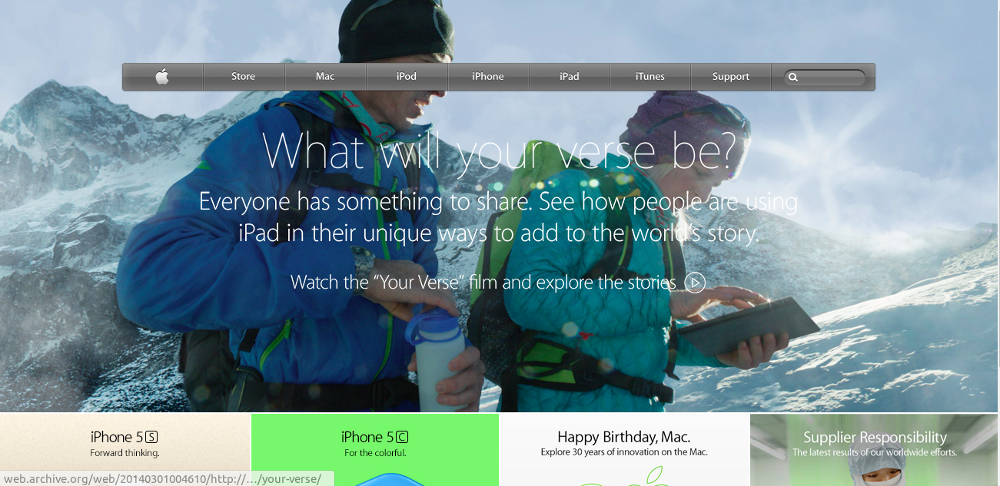

# BUILDING WITH BACKGROUNDS AND GRADIENTS

> This project consists of building a webpage using images as a background and adding gradients to elements. The goal is to make a clone of old an old version of the Apple website webpage. You can find the original project specification [here](https://www.theodinproject.com/courses/html5-and-css3/lessons/building-with-backgrounds-and-gradients)

## Built With

- HTML,
- CSS

## Getting Started

To test the code please clone the repository [here](https://github.com/kiptubei/Apple_Background)

Run the index file with Google Chrome Browser

### Prerequisites

HTML5 and CSS3 compatible browser

### Deployment

You can use [raw githack](https://raw.githack.com/) to view this page directly from github.

You can view the site itself [here]() .Have fun!

## Authors

👤 **Mark James Kiptubei**

- Github: [@kiptubei](https://github.com/kiptubei)
- Email: [kiptubei@gmail.com](kiptubei@gmail.com)

## 🤝 Contributing

Contributions, issues and feature requests are welcome!

## Show your support

Give a ⭐️ if you like this project!

## Acknowledgments

- Microverse

## 📝 License

This project is [MIT](lic.url) licensed.
